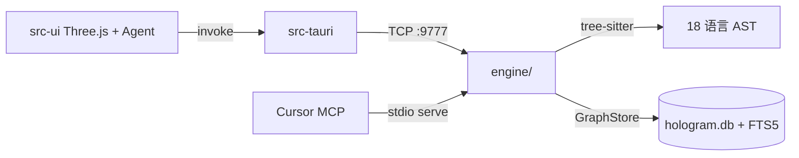

# Agent 项目理解 — HoloGram

> 生成：2026-06-18 · 更新：2026-06-25 · 供 Cursor/Claude 等 Agent 快速上手  
> 详细架构见 [PROJECT.md](PROJECT.md)

## 一句话

把代码库变成可对话的 3D 依赖星图——18 语言统一 IR，25 个 MCP 工具直查图，不是让 LLM 猜源码。

## 目录结构

```
HoloGramHG/
├── engine/          Rust 分析引擎（25 MCP 工具）
├── src-tauri/       Tauri 2 壳（命令桥接 + 安全沙箱）
├── src-ui/          TypeScript 前端（Three.js + Agent + Monaco）
├── tests/           遗留 Python 测试（引擎已 Rust 化，部分仍可用）
├── assets/          图标、UI 原型
├── .cursor/rules/   Agent 持久化规则（4 个 .mdc）
├── PROJECT.md       现状说明
├── BUGS.md          活 bug 清单（用户写，Agent 修）
├── CLAUDE.md        Agent 工作指令
└── V4_CONSTRUCTION_PLAN.md  v4 施工方案（已竣工）
```

## 数据流



## 分析能力栈

| 版本 | 能力 | 关键模块 |
|------|------|----------|
| V1 | 节点/边/社区/BFS/路径/diff | `graph/`, `community/` |
| V2 | L1-L4 耦合、数据流环、线程冲突、盲点 | `analysis/` |
| V3 | L5-L1 破坏信号、YAML 约束、变更简报 | `routing/` |
| v4+ | 框架路由(8)、动态调度合成、NL explore | `framework_routes`, `dynamic_dispatch`, `explore` |

## Agent 操作手册

1. **探索代码：** 优先 MCP `hologram_explore`（自然语言 query）
2. **高风险模块：** `hologram_fragile` · `hologram_cycle`
3. **改引擎：** `cd engine && cargo test --lib`
4. **改前端：** `cd src-ui && npx tsc --noEmit`
5. **打包：** `cargo tauri build`（前端改动需先 `npm run build`）

## 持久化规则索引

| 规则文件 | 作用域 |
|----------|--------|
| `.cursor/rules/hologram-overview.mdc` | 始终生效 — 产品/架构/用户 |
| `.cursor/rules/hologram-engine.mdc` | `engine/**` |
| `.cursor/rules/hologram-frontend.mdc` | `src-ui/**` |
| `.cursor/rules/hologram-tauri.mdc` | `src-tauri/**` |

## 不要做的事

- 不要恢复 Python 引擎路径
- 不要改 `graph.ts` layout3D 参数（除非用户明确要求）
- 不要在程序层「推断 bug 根源」或「解释因果」——只呈现图数据
- 不要用 `cargo build --release` 代替 `cargo tauri build`
