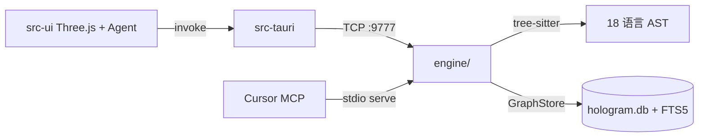

# Agent 项目理解 — HoloGram

> 生成：2026-06-18 · 更新：2026-08-04 · 供 Cursor/Claude 等 Agent 快速上手  
> 架构与现状见 `docs/`（architecture-refactor-spec.md / agents/frontend-refactor-handoff.md）；多 Agent 路线图见 docs/MULTI_AGENT_ROADMAP.md

## 一句话

把代码库变成可对话的 3D 依赖星图——18 语言统一 IR，25 个 MCP 工具直查图，不是让 LLM 猜源码。

## 目录结构

```
HoloGramHG/
├── engine/          Rust 分析引擎（25 MCP 工具）
├── src-tauri/       Tauri 2 壳（命令桥接 + 安全沙箱）
├── src-ui/          TypeScript 前端（Three.js + Agent + Monaco；观测台重构 P0–P6 + 视觉深化 P7 全系列已竣工）
├── tests/           遗留 Python 测试（引擎已 Rust 化，部分仍可用）
├── assets/          图标、UI 原型
├── docs/            架构与交接文档（agents/frontend-refactor-handoff.md = 前端重构事实来源）
├── CLAUDE.md        Agent 工作指令
└── V4_CONSTRUCTION_PLAN.md  v4 施工方案（已竣工）
```

> 注：PROJECT.md / BUGS.md 已移除（2026-07 归档删除），现状以 docs/ 与 docs/MULTI_AGENT_ROADMAP.md 为准。

### `.hologram/` 运行时目录结构

```
.hologram/
├── agents/{agentId}/inbox.json   跨 Agent 消息持久化（JsonMessageStore）
├── taskboard/{sessionId}.json     会话级 TaskBoard（每个会话独立）
├── discoveries/{sessionId}.json   会话级 DiscoveryBoard（每个会话独立）
├── goals/{id}/                    Goal 管理器状态
├── permissions.json               权限规则（项目级）
└── memory/                        Agent 记忆
```

## 数据流


```mermaid
flowchart LR
  UI[src-ui Three.js + Agent] -->|invoke| Tauri[src-tauri]
  Tauri -->|TCP :9777| Engine[engine/]
  Engine -->|tree-sitter| AST[18 语言 AST]
  Engine -->|GraphStore| DB[(hologram.db + FTS5)]
  MCP[Cursor MCP] -->|stdio serve| Engine
```

## 分析能力栈

| 版本 | 能力 | 关键模块 |
|------|------|----------|
| V1 | 节点/边/社区/BFS/路径/diff | `graph/`, `community/` |
| V2 | L1-L4 耦合、数据流环、线程冲突、盲点 | `analysis/` |
| V3 | L5-L1 破坏信号、YAML 约束、变更简报 | `routing/` |
| v4+ | 框架路由(24)、动态调度合成、NL explore | `framework_routes`, `dynamic_dispatch`, `explore` |

## Agent 操作手册

1. **探索代码：** 优先 MCP `hologram_explore`（自然语言 query）
2. **高风险模块：** `hologram_fragile` · `hologram_cycle`
3. **改引擎：** `cd engine && cargo test --lib`
4. **改前端：** `cd src-ui && npx tsc --noEmit`
5. **打包：** `cargo tauri build`（前端改动需先 `npm run build`）

### 子 Agent 工具集（A2）

| 工具 | 用途 |
|------|------|
| `agent_spawn` | 派发子 Agent（fork/fresh 模式，支持异步） |
| `agent_kill` | 停止运行中的子 Agent（幂等） |
| `agent_status` | 运行中子 Agent 可观测状态（当前工具/等待时长/最后事件，>120s 标疑似卡死） |
| `agent_merge` | 合并异步子 Agent 的 worktree |
| `agent_isolation_create` | 创建隔离 worktree |
| `agent_isolation_diff` | 查看隔离 worktree 的 diff |
| `agent_isolation_merge` | 合并隔离 worktree |
| `agent_isolation_discard` | 丢弃隔离 worktree |

子 Agent ID 命名空间：
- 模型可见 ID：`sub-{timestamp}-{random}` — 用于 board/bus/UI
- 池内部 ID：`subagent-{timestamp}-{random}` — 不暴露给模型
- 隔离 worktree ID：`agent-{timestamp}-{random}` — 用于 worktree 路径映射

## 目标模式（/goal）

- **用法：** `/goal 描述` 新建 · `/goal resume` 恢复 · `/goal status` 查看 · `/goal cancel` 取消
- **架构：** `src-ui/src/agent/goal-manager.ts`(GoalManager 一等状态对象)驱动 `Agent._goalLoop`;状态存 `.hologram/goals/{id}/`(goal.json + session.json + index.json),与普通聊天的 `agents/main/` 槽**完全隔离**——普通对话的 saveState 不会踩 goal 现场
- **完成判定：** 模型调用 `goal_report(status, summary)` 工具上报(仅 goal 循环期间注册);`[GOAL_COMPLETE]` 文本标记仅为旧会话 fallback
- **崩溃接管：** 启动时 `migrateLegacy()`(旧 `agents/main/goal.json` 导入)+ `adoptOrphans()`(遗留 active 记录转 paused)
- **UI:** 聊天区上方状态条订阅 `goal:state` 事件;测试见 `tests/goal-manager.test.ts` 与 `tests/goal-persistence.test.ts`(含暂停→闲聊→恢复回归)

## 不要做的事

- 不要恢复 Python 引擎路径
- 不要改 `graph-layout.ts` / `gpu-layout.ts` 的布局参数（除非用户明确要求）
- 不要在程序层「推断 bug 根源」或「解释因果」——只呈现图数据
- 不要用 `cargo build --release` 代替 `cargo tauri build`
