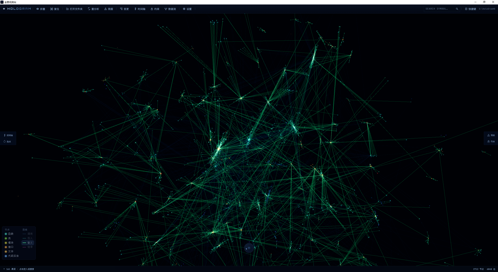
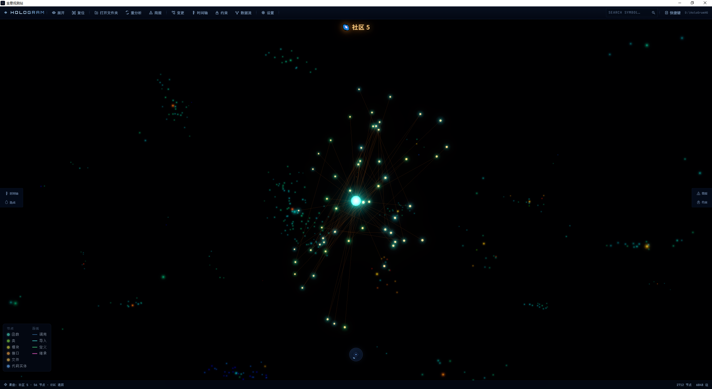
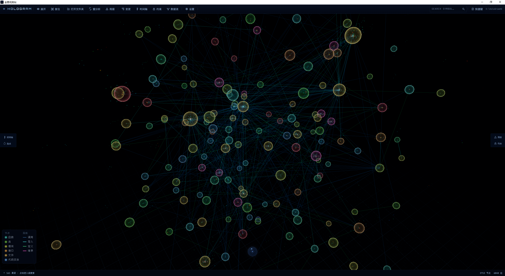
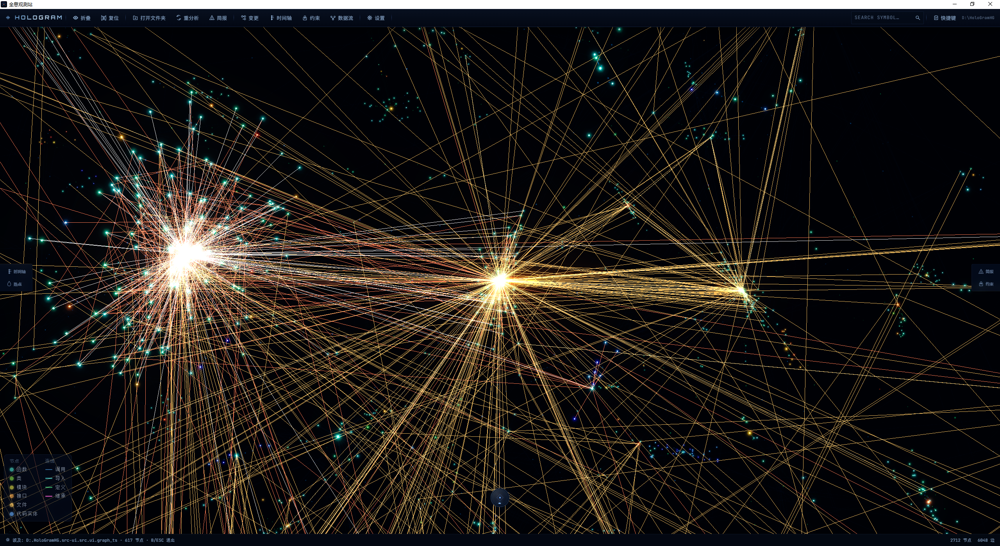
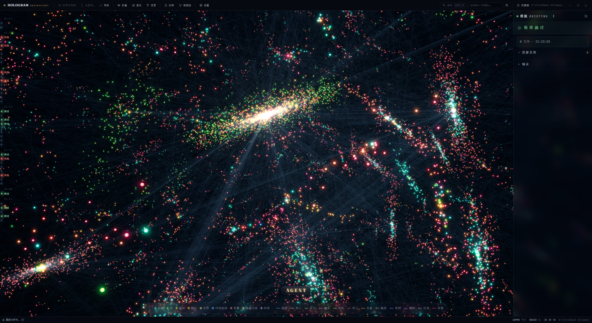
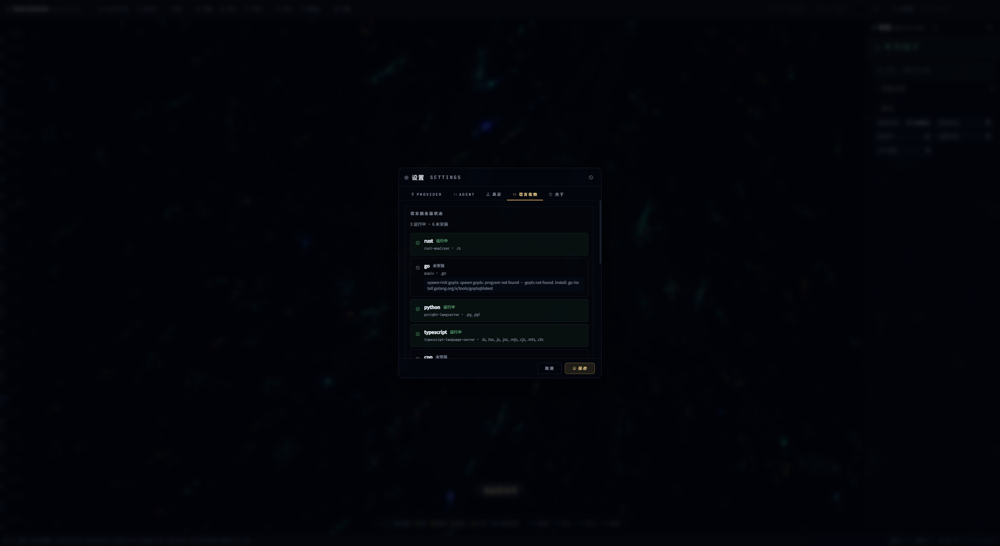
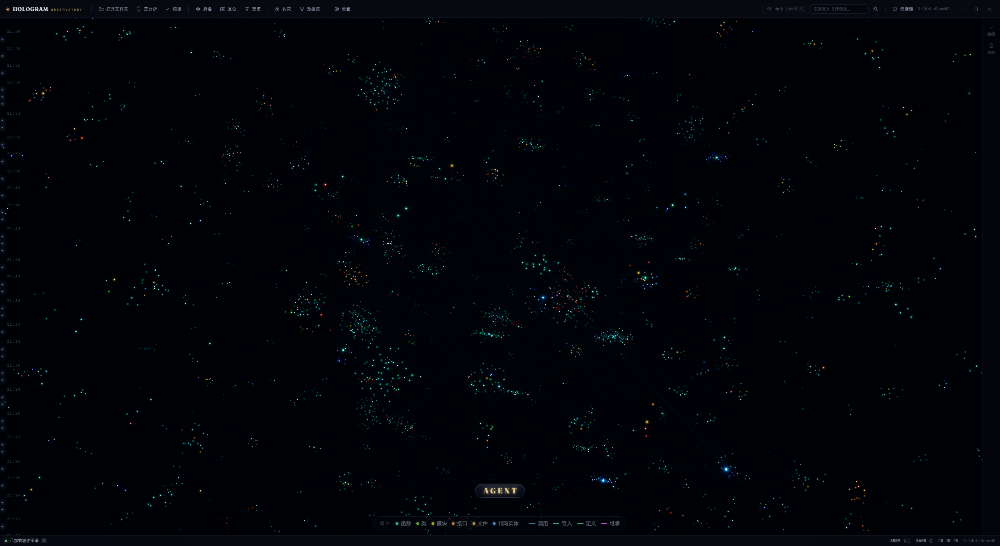
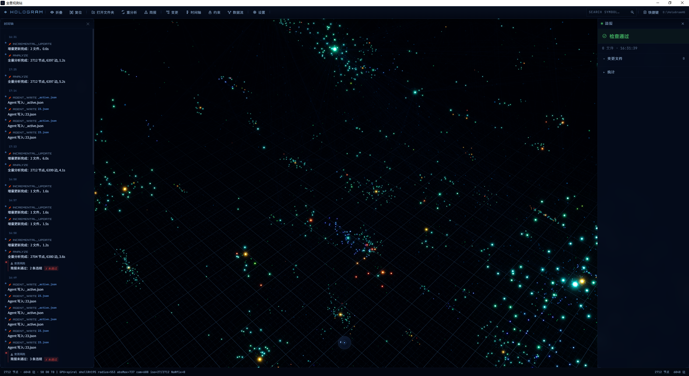

<p align="center">
  
</p>

<p align="center">
  <strong>© 2026 Wenbing Jing. Licensed under MIT.</strong><br/>
  <em>This software is free for any use. Attribution required.</em>
</p>

<p align="center">
  <a href="LICENSE"></a>
  <a href="https://github.com/834063245-creator/HoloGram/releases"></a>
  <a href="https://github.com/834063245-creator/HoloGram/actions"></a>
  <a href="https://github.com/834063245-creator/HoloGram/releases"></a>
  <a href="https://github.com/834063245-creator/HoloGram/pulls"></a>
</p>

<br/>

> 🧠 **给你的 AI 编程助手装一双"眼睛"。**
>
> HoloGram 把你的代码库变成一张依赖拓扑图——Agent 不用逐层翻源文件，一次工具调用就知道「改这里会不会炸」、「哪些地方会被波及」。
>
> **26 门语言 · 零配置 · 省 ~70% token。**

---

## 📖 目录

- [🎯 什么人需要这个](#-什么人需要这个)
- [⚡ 5 分钟上手](#-5-分钟上手)
- [✨ 它能做什么](#-它能做什么)
- [📊 真实案例：改一个函数会炸多少](#-真实案例改一个函数会炸多少)
- [🖥️ 桌面应用（可选）](#️-桌面应用可选)
- [🌐 支持的语言](#-支持的语言)
- [🗺️ 工具地图](#️-工具地图)
- [🏗️ 架构总览](#️-架构总览)
- [🔨 从源码构建](#-从源码构建)
- [⚠️ 已知局限](#️-已知局限)
- [❓ 常见问题 (FAQ)](#-常见问题-faq)
- [🔧 故障排查](#-故障排查)
- [👩‍💻 开发](#-开发)
- [📄 许可证](#-许可证)

---

## 🎯 什么人需要这个

<p align="center">
  <table>
    <tr>
      <td align="center" width="33%"><h3>🤖<br/>AI 编码工具用户</h3></td>
      <td align="center" width="33%"><h3>🔍<br/>接手老项目的开发者</h3></td>
      <td align="center" width="33%"><h3>🏛️<br/>技术负责人 / 架构师</h3></td>
    </tr>
    <tr>
      <td>Agent 读源文件猜依赖，一层层翻代码，又慢又容易漏。弱模型还经常翻漏——漏一个，后面改了就炸。</td>
      <td>代码库没文档、不知道模块之间的真实关系、不敢随便改——牵一发动全身。</td>
      <td>需要盯模块边界、防止循环依赖、管控架构腐化——人工 Code Review 盯不过来。</td>
    </tr>
    <tr>
      <td>✅ 全库依赖提前算好<br/>✅ 一次调用代替逐层翻文件<br/>✅ 改前自动告诉波及范围</td>
      <td>✅ 打开项目 → 3D 星图<br/>✅ 谁调了谁一目了然<br/>✅ 改了谁会炸，点一下就知道</td>
      <td>✅ 自定义约束规则<br/>✅ 越界自动标红<br/>✅ 循环依赖 / 脆弱模块 / 盲区扫描</td>
    </tr>
  </table>
</p>

> 💡 **简单说：如果你在用 AI 写代码，HoloGram 让 AI 更聪明。如果你是人在维护代码，HoloGram 让你更快看懂。**

---

## ⚡ 5 分钟上手

### 🤙 方式一：MCP 模式（推荐 · 1 分钟 · 零界面）

**不需要桌面应用。** 引擎是单文件二进制，26 种语法静态链接，零依赖。支持 Windows 和 Linux。

```
┌─────────────────────────────────────────────────────────┐
│                                                         │
│   1.  复制下面那段话                                     │
│   2.  粘贴到 Claude Code / Cursor                        │
│   3.  回车                                               │
│                                                         │
│   🎉 搞定。Agent 自己下载、配置、验证。                    │
│                                                         │
└─────────────────────────────────────────────────────────┘
```

> 复制这段话发给你的 AI 编程工具：

```
请帮我安装 HoloGram MCP 服务。步骤：

1. 从 https://github.com/834063245-creator/HoloGram/releases 下载：
   - Windows: hologram-engine-windows-x64.zip
   - Linux:   hologram-engine-linux-x64.tar.gz
2. 解压后运行安装脚本：
   - Windows: 双击 install.cmd
   - Linux:   ./install.sh --user
3. 在当前 AI 编程工具的 MCP 配置中注册：
   - command: hologram-engine
   - args: serve
4. 重启 AI 编程工具，调 engine_status 验证
```

安装成功后，直接问：「分析这个项目」「改 auth.py 会炸吗」「有没有循环依赖」——Agent 自动调 HoloGram。

<details>
<summary>📝 手动配置（习惯自己来？）</summary>
<br/>

**Claude Code** — `~/.claude/mcp.json`：
```json
{
  "mcpServers": {
    "hologram": {
      "command": "hologram-engine",
      "args": ["serve"]
    }
  }
}
```

**Cursor** — Settings → MCP → Add new MCP server，command: `hologram-engine`，args: `serve`。
</details>

### 💻 方式二：CLI 命令行工具

安装后还可以直接在终端使用，适合脚本化场景：

```bash
hologram run --list                           # 查看所有工具
hologram run graph_summary .                   # 项目概览
hologram run trace_impact . --node_id src/main.rs:main  # 查影响面
hologram run preflight_check . --files a.rs,b.rs        # 改前检查（exit code 表达 pass/fail）
hologram run detect_cycles .                    # 检测循环依赖
```

> 💡 `preflight_check` 的 exit code：0=低风险，1=高风险（critical/high），适合 CI/CD 和 git hooks。

### 🖥️ 方式二：桌面应用

[Releases](https://github.com/834063245-creator/HoloGram/releases) → 下载 `.msi` → 双击 → 选项目 → 自动出图。

> ⚠️ 桌面应用目前仅 Windows。macOS / Linux 请用 MCP 模式。

---

## ✨ 它能做什么

| 能力 | 一句话 |
|:-----|:-------|
| 🎯 **改前查影响** | 改一个文件 → 立刻看到波及范围。Agent 在 `edit_file` / `write_file` 执行前**自动注入 ⚠️ 影响分析** |
| 🚨 **自动抓越界** | 模块之间乱 import？自动标红。你定规则（glob/regex），它替你盯着 |
| 💸 **给 Agent 省 token** | 一次调用拿结构化依赖数据，典型场景省 ~70% token |
| 🌌 **3D 代码地图** | 代码库变星图，谁依赖谁一眼看穿。5000 文件不卡，GPU 加速布局 |
| 🔄 **保存即刷新** | 代码保存 → 图自动更新。缓存过期检测，源文件更新时自动重分析 |
| 🌍 **26 门语言，零配置** | 打开项目直接出图。不需要配置文件、不需要标注 |

---

## 📊 真实案例：改一个函数会炸多少

### 场景：改 `auth.py` 里的 `validate_token()`

```
         ❌ 不用 HoloGram                          ✅ 用 HoloGram
    ┌──────────────────────┐                ┌──────────────────────┐
    │ 读 auth.py          │   ~800 tok     │ explore_deps()       │
    │ 读 models.py        │   ~700 tok     │           ║          │
    │ 读 utils.py         │   ~600 tok     │    一次调用，1,700 tok │
    │ 搜谁调了它          │   ~400 tok     │           ║          │
    │ 读 3 个调用者       │ ~2,100 tok     │   引擎 BFS 全库依赖图   │
    │ 综合推理            │ ~1,200 tok     │   结构化 JSON 返回     │
    │ ⚠️ 间接调用 → 漏报! │                │   间接调用 → 全捕获   │
    ├──────────────────────┤                ├──────────────────────┤
    │  合计: ~5,800 token  │                │  合计: ~1,700 token  │
    └──────────────────────┘                └──────────────────────┘
```

| | 不用 HoloGram | 用 HoloGram | 省 |
|:--|--:|--:|--:|
| 单次查询 | ~5,800 tok | ~1,700 tok | **~70%** |
| 一次编码会话 (5 次) | ~29,000 tok | ~8,500 tok | **~20,000 tok** |
| 月均 (30 次会话) | ~870,000 tok | ~255,000 tok | **~600,000 tok** |
| 十人团队月均 | ~8,700,000 tok | ~2,550,000 tok | **~6,000,000 tok** |

> 💡 **省 token 是小头。大头是：弱模型推依赖容易漏，HoloGram 给的图是确定性静态分析——比靠读源文件猜依赖可靠得多。**

### 🧪 真实案例：FirstBeat Ultimate 项目体检

> 2026-06-21 · 218 符号 · 322 边 · ~4,400 行 Python · 21 个源文件

| 你想知道 | HoloGram | 手工做法 | 省多少 |
|:--|:--|:--|:--|
| 🔍 有循环依赖吗？ | `detect_cycles` → 200 tok | 读完 4400 行 + 画拓扑图找环 | **~500x** |
| 📊 哪些模块最脆弱？ | `fragile_modules` → 300 tok | 218 个符号逐个 grep fan-in | **~150x** |
| 🗂️ 整体结构？ | `cluster_report` → 2,500 tok | 人工分 32 个社区——根本做不准 | **~40x** |
| 💣 改 engine.close 会炸多少？ | `trace_impact` → 800 tok | 手动追踪 3 层调用链 / 8-10 文件 | **~37x** |

> **单点查询省 70%，全局分析省 95%（20 倍+）。项目越大，差距越悬殊。**

---

## 🖥️ 桌面应用（可选）

<p align="center">
  &nbsp;
  &nbsp;
  &nbsp;
  
</p>
<p align="center">
  &nbsp;
  &nbsp;
  &nbsp;
  
</p>

| 特性 | 说明 |
|:--|:--|
| 🌌 **3D 代码星图** | Three.js + WebGPU，颜色按社区聚类，缩放旋转拖拽随心 |
| 💬 **内置 Agent 面板** | 对话、文件操作、Git、Shell、Web 搜索，全在应用内 |
| 📝 **Monaco 编辑器** | 点击节点 → 右侧直接打开源码 |
| 🔗 **数据流面板** | 追踪变量读写路径，可视化数据流向 |
| 🕐 **时间轴面板** | 变更历史 + 分析记录一览 |
| 🍴 **子 Agent 并行** | git worktree 隔离，多 Agent 同时工作互不干扰 |
| 🧠 **记忆系统** | Markdown + AuraSDK 语义召回，跨会话记住上下文 |

> 💡 桌面应用和 MCP 模式用的是**同一个引擎**——所有图分析能力完全一致。

---

## 🌐 支持的语言

```
  Python  ·  TypeScript / JavaScript  ·  Go  ·  Rust  ·  Java  ·  C / C++
  Ruby  ·  Lua  ·  C#  ·  Swift  ·  Dart  ·  Scala  ·  Haskell  ·  HTML
  CSS  ·  PHP  ·  OCaml  ·  R  ·  Nix  ·  Bash  ·  YAML  ·  Zig  ·  Elixir
  Erlang  ·  Kotlin  ·  TOML  ·  Markdown
```

> 🌍 26 门静态链接 + 3 门动态加载。零配置——打开目录，自动识别。

---

## 🗺️ 工具地图

> 30 个图查询工具 + 50+ 个编码操作工具，覆盖「查依赖 → 改代码」完整链路。

| 类别 | 工具 | 你问 → 它答 |
|:--|:--|:--|
| 🔍 **日常查询** | `explore_deps` `search_symbols` `get_neighbors` `inspect_symbol` | "这个函数连了啥？" "谁在调它？" |
| 💣 **风险评估** | `trace_impact` `preflight_check` `fragile_modules` `detect_cycles` | "改这里会炸吗？" "有没有循环依赖？" |
| 🩺 **架构诊断** | `arch_blindspots` `thread_conflicts` `coupling_report` `check_boundaries` | "隐藏的架构问题？" "边界被偷越了吗？" |
| 🔗 **数据流** | `trace_dataflow` `async_edges` `find_dep_path` | "变量在哪被改了？" "A 怎么依赖到 B 的？" |
| 🌍 **全局视野** | `graph_summary` `cluster_report` `project_health` `project_timeline` | "项目整体怎么样？" "有哪些子系统？" |
| 🎯 **LSP 精确** | `resolve_call` `infer_type` `find_implementations` `find_references` | "这个调用到底调了哪个实现？" |
| 🛠️ **工程** | `analyze_project` `validate_project` `graph_diff` `find_unused` `rename_symbol` | 全量分析、约束校验、找死代码、安全重命名 |

**Agent 内置编码工具：** 文件读写 · Git 全套 · Shell · 搜索 · Web · 记忆 · 任务 · 子 Agent 分叉

> 💡 所有工具对 Agent 透明——统一调用。返回结构化 JSON，不是源文件——**省 token**。

---

## 🏗️ 架构总览

```
 ┌────────────────────── 桌面壳 (Tauri 2) ──────────────────────────┐
 │                                                                    │
 │  ┌── 前端 (TypeScript) ──────────────┐  IPC  ┌── Rust 后端 ────┐ │
 │  │  🌌 3D 星图  ·  💬 Agent 面板     │◄────►│  🛡️ 权限裁决     │ │
 │  │  📝 Monaco    ·  🔗 数据流面板    │      │  🏖️ OS 沙箱      │ │
 │  │  🕐 时间轴    ·  ⚛️ React UI      │      │  🍴 Agent 隔离   │ │
 │  │  ⚡ WebGPU    ·  🎯 LSP 客户端    │      │  📋 审计日志     │ │
 │  └───────────────────────────────────┘      └──────┬───────────┘ │
 └────────────────────────────────────────────────────┼─────────────┘
                                                      │ MCP stdio
       ┌──────────────────────────────────────────────▼──────────────┐
       │             🧠 Rust 引擎 (engine/)                          │
       │                                                              │
       │   合并管线 · 边去重 625× · 30 图工具 · 四级过滤              │
       │   MemoryIndex + SQLite FTS5 · 增量更新 · Leiden 社区发现     │
       │   数据流引擎 (17 语言) · 18 框架路由 · LSP 按需 · 语义记忆   │
       └──────────────────────────────────────────────────────────────┘
```

| 层 | 目录 | 技术栈 |
|:--|:--|:--|
| 🧠 引擎 | `engine/` | Rust — 解析 · 图构建 · 分析 · 存储 · MCP |
| 🐚 壳 | `src-tauri/` | Rust / Tauri 2 — 权限 · 沙箱 · 隔离 · 加密 |
| 🎨 前端 | `src-ui/` | TypeScript — Three.js · React · Monaco · WebGPU |

> 🔬 **自举验证：HoloGram 用自己的引擎分析自己的代码库。**

---

## 🔨 从源码构建

**系统要求：** Rust 1.80+ · Node.js 20+（桌面应用额外需要 Windows 10+）

```bash
git clone https://github.com/834063245-creator/HoloGram.git
cd HoloGram

# 仅引擎 — MCP 模式只需要这个（Linux / Windows 均可）
cd engine && cargo build --release    # → engine/target/release/hologram-engine

# 桌面应用（仅 Windows）
cd src-tauri && cargo tauri build     # → src-tauri/target/release/bundle/
```

---

## ⚠️ 已知局限

> 静态分析有天花板。这五项不是 bug，是物理上限。我们选择诚实面对——全部通过合成边和标记节点给出了诚实的答案。

| 盲区 | 说明 | 状态 |
|:--|:--|:--|
| 字符串路由 | Express / Django 等路由字符串 → handler 映射 | ✅ 18 种框架已覆盖 |
| 动态 import | `import(variable)` / `require(expr)` | ✅ 动态导入站点已标记 |
| 反射 / DI | getattr / @Autowired / @Injectable 等 | ✅ 10 语言已处理 |
| 跨语言调用 | 子进程 / FFI / HTTP client → 运行时桥接点 | ✅ 8 语言已覆盖 |
| eval / 动态代码 | eval / exec / new Function | ✅ 已诚实标记为不可达 |

---

## ❓ 常见问题 (FAQ)

<details>
<summary><strong>🔀 MCP 模式和桌面应用有什么区别？</strong></summary>
<br/>
引擎完全一样——同一套图分析能力。MCP 模式无界面，通过 AI 工具的 MCP 协议调用。桌面应用多了 3D 可视化、编辑器、聊天面板等 UI。

→ 只要 Agent 增强 → MCP 模式 · 想可视化浏览 → 桌面应用
</details>

<details>
<summary><strong>🍎 支持 macOS / Linux 吗？</strong></summary>
<br/>

**引擎 + CLI：** ✅ Windows 和 Linux 均有 CI 测试和预编译二进制发布。从 [Releases](https://github.com/834063245-creator/HoloGram/releases) 下载对应平台包，运行安装脚本即可。macOS 可从源码编译（`cargo build --release`）。

**桌面应用：** ⚠️ 目前仅 Windows。沙箱（JobObject / bubblewrap / sandbox-exec）、权限层、凭据层（DPAPI / Keychain / Secret Service）均已三平台实现，但尚未在 CI 中构建 Linux/macOS 桌面端。
</details>

<details>
<summary><strong>🔒 需要联网吗？代码会传到外部吗？</strong></summary>
<br/>

**不会。** 引擎全部本地运行，代码不离开你的机器。仅两个例外：1) 桌面应用内的 Agent 调用你配置的 LLM API；2) 你手动触发 Web 搜索时。
</details>

<details>
<summary><strong>🐘 大项目会卡吗？</strong></summary>
<br/>
不会。rayon 并行解析（200 文件/批），边去重 625× 削减。Django 3031 文件 ~4.1 秒全量分析。3D 星图 GPU 加速，5000 节点流畅。增量模式下保存秒级更新。
</details>

<details>
<summary><strong>📏 能分析多大项目？</strong></summary>
<br/>
实测无上限。四级过滤自动排除 node_modules / vendor / target。> 1 MB 文件自动跳过。引擎自身体检：3965 节点 / 5328 边，毫秒级查询。
</details>

<details>
<summary><strong>🌍 能跨语言追踪吗？</strong></summary>
<br/>
能。多语言项目（Python + TypeScript 等）统一建模进一张图。跨语言调用（子进程、HTTP、FFI）通过合成边标记为运行时桥接点。
</details>

<details>
<summary><strong>🪞 反射和动态调用能检测吗？</strong></summary>
<br/>
部分能。反射 / DI（getattr、@Autowired）通过类型级解析补充。纯字符串反射标记为动态站点。诚实标记——不假装知道运行时才知道的事。
</details>

<details>
<summary><strong>⚖️ 和 SonarQube / CodeClimate 有什么区别？</strong></summary>
<br/>
互补，不替代。SonarQube 做代码质量（bug、漏洞、坏味道），HoloGram 做依赖拓扑和 Agent 增强。用 SonarQube 发现问题，用 HoloGram 让 AI 更聪明地改。
</details>

<details>
<summary><strong>💰 收费吗？</strong></summary>
<br/>
**完全免费。MIT 开源。** 引擎、桌面应用、MCP 全部免费。商用、修改、再发布——只需保留版权声明。
</details>

<details>
<summary><strong>🔑 LLM API 费用呢？</strong></summary>
<br/>
Agent 功能需要你自己配置 LLM API key（支持 Anthropic / OpenAI 兼容接口）。HoloGram 不提供 API key，不收费。API 费用由 LLM 提供商收取。
</details>

---

## 🔧 故障排查

### MCP 模式

| 症状 | 原因 | 解药 |
|:--|:--|:--|
| `engine_status` 无响应 | MCP 服务未注册 | 检查 MCP 配置文件路径和 command |
| 工具返回空结果 | 引擎还没分析项目 | 先调 `analyze_project` 做全量分析 |
| "engine not found" | 引擎不在 PATH 上 | 重新运行 install.sh / install.cmd |
| 引擎启动失败 (Windows) | 缺少 VC++ Redistributable | [下载安装](https://aka.ms/vs/17/release/vc_redist.x64.exe) |
| 引擎启动失败 (Linux) | 缺少 C++ 运行时 | `sudo apt install libstdc++6` |

### 桌面应用

| 症状 | 原因 | 解药 |
|:--|:--|:--|
| 白屏 / 加载失败 | WebView2 未安装 | [下载 WebView2 Runtime](https://developer.microsoft.com/en-us/microsoft-edge/webview2/) |
| 分析一直转圈 | 首次分析大项目需时 | 耐心等，或查看 `.hologram/logs/engine.log` |
| 3D 图卡顿 | GPU 驱动旧 | 更新显卡驱动（WebGPU 需要较新驱动） |
| Agent 无响应 | API key 未配置 | 检查设置面板 → API 配置 |

### 通用

| 症状 | 解药 |
|:--|:--|
| 分析结果对不上 | 看 `.hologram/logs/engine.log` 过滤日志 |
| 增量更新不生效 | 手动触发全量：`analyze_project` 或重启应用 |
| 想报 bug？ | [GitHub Issues](https://github.com/834063245-creator/HoloGram/issues) — 带上 `.hologram/logs/` 日志 |

---

## 👩‍💻 开发

```bash
cd engine && cargo test              # 462+ Rust 引擎测试
cd src-tauri && cargo test           # 143+ Tauri 壳测试
cd src-ui && npx vitest run          # 401+ 前端测试
cd engine && cargo build --release   # 编译引擎
cargo tauri build                    # 打包桌面应用
cd src-ui && npm run build           # 类型检查 + 打包前端
```

```
  engine/         🧠 Rust 引擎 — 管线 · 过滤 · 数据流 · 路由 · LSP · 30 工具
  src-tauri/      🐚 Tauri 壳 — 权限 · 沙箱 · 隔离 · PTY · 凭证 · 审计
  src-ui/         🎨 前端 — Three.js · React · Monaco · Agent · WebGPU
  assets/         🖼️ 图标 · 截图
  grammars/       📦 动态语法 DLL (Kotlin / TOML / Markdown)
  build/          🔧 构建脚本
```

<details>
<summary>📐 分析管道 (8 阶段)</summary>
<br/>

| # | 阶段 | 说明 |
|:--|:--|:--|
| 1 | 文件发现 | 四级过滤 — 黑名单 + .gitignore + 扩展名 + 1 MB 上限 |
| 2 | 并行解析 + 合并 | 200 文件/批，rayon 并行，全局去重 (625× 削减) |
| 3 | 类型感知调用解析 | 8 语言 tree-sitter 类型级解析，30s 熔断 |
| 4 | 跨文件解析 | import → 调用链连接 |
| 5 | 耦合分析 | L1-L4 耦合深度赋值 |
| 6 | 框架路由 | 18 种框架 URL→handler 映射 |
| 7 | 动态调度合成 | addEventListener / .on() / .then() / .subscribe() |
| 8 | 社区发现 + 持久化 | Leiden 层次聚类，MemoryIndex + SQLite |

</details>

<details>
<summary>💾 存储引擎</summary>
<br/>

| 组件 | 特点 |
|:--|:--|
| MemoryIndex | 邻接表 + 倒排索引，O(degree) 查询 |
| SqliteDb | hologram.db + FTS5 全文搜索 |
| GraphStore | MemoryIndex + SqliteDb，`parking_lot::RwLock` N 路并发读 |
| 增量更新 | watcher → 防抖 → 重解析 → diff → 边修复 → 原子 swap |

</details>

<details>
<summary>🧩 图数据模型</summary>
<br/>

**8 种节点：** Symbol · Function · Class · Module · File · Interface · Medium（存储/IO）· Temporal（异步任务）
——每个节点携带 location、degree、community_id、3D 坐标。

**10 种边：**
- 结构边：`imports` `calls` `inherits` `defines` — 管道预计算
- 数据边：`reads` `writes` `shares` — 数据流引擎按需查询
- 时序边：`triggers` `awaits` `sequences` — 含 `temporal_delay_sec`

每条边附加 coupling_depth (L1-L4)、cross_file、direction、lsp_resolved。

</details>

---

## 📄 许可证

HoloGram © 2026 Wenbing Jing — [MIT](LICENSE)

本项目使用了多个第三方开源组件（AuraSDK、tree-sitter 语法库、SQLite、mimalloc、USearch 等）。完整版权声明见 **[THIRD_PARTY_NOTICES.md](THIRD_PARTY_NOTICES.md)**。

---

<p align="center">
  <br/>
  <em>Built with ❤️ and Rust. One person, ~94,000 lines of code, 257 source files, 26 languages, 1000+ tests.</em>
</p>
